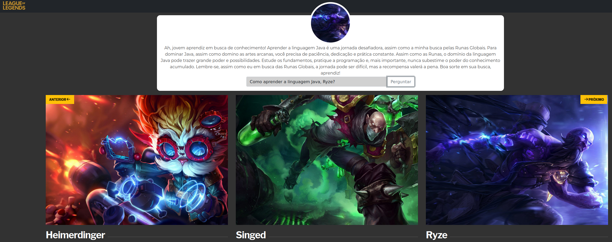

# README

Este repositório contém um projeto desenvolvido como parte da Santander Dev Week 2024 em parceria com a Digital Innovation One. O projeto é dividido em duas partes principais: uma aplicação Java e uma aplicação JavaScript.

## Aplicação Java

### Estrutura do Projeto

O projeto Java segue uma estrutura padrão de um aplicativo Spring Boot:

- **Application.java**: Classe principal que inicia a aplicação Spring Boot.
- **ApplicationConfig.java**: Configuração da aplicação Spring Boot.
- **adapters**: Pacote contendo adaptadores para entrada e saída de dados.
- **application**: Pacote contendo casos de uso da aplicação.
- **domain**: Pacote contendo as entidades e regras de negócio da aplicação.
- **exceptions**: Pacote contendo classes de exceção personalizadas.
- **ports**: Pacote contendo as interfaces dos repositórios.
- **repositories**: Pacote contendo implementações dos repositórios.

### Funcionalidades

- **Listagem de Campeões**: Endpoint para listar todos os campeões disponíveis.
- **Fazer Pergunta a um Campeão**: Endpoint para fazer uma pergunta sobre um campeão específico e receber uma resposta.

## Aplicação JavaScript

### Estrutura do Projeto

O projeto JavaScript é uma aplicação frontend desenvolvida utilizando HTML, CSS, e JavaScript puro:

- **index.html**: Página principal da aplicação.
- **style.css**: Arquivo de estilo para a página.
- **script.js**: Arquivo JavaScript contendo a lógica da aplicação.

### Funcionalidades

- **Listagem de Campeões**: Requisição AJAX para obter a lista de campeões e renderização dinâmica na página.
- **Fazer Pergunta a um Campeão**: Requisição AJAX para enviar uma pergunta sobre um campeão específico e receber uma resposta.

## Como Executar

1. Clone o repositório para sua máquina local.
2. Para a aplicação Java, abra o projeto em sua IDE Java favorita e execute a classe `Application.java` para iniciar o servidor.
3. Para a aplicação JavaScript, abra o arquivo `index.html` em um navegador da web para visualizar a página da aplicação.

## Foto do projeto final
